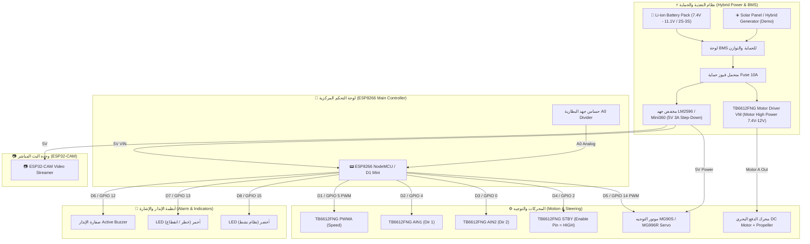

#  دليل وتصميم لوحة التوصيلات (Hardware Design Specification HDS v1.0)

---

##  1. الهيكلية العامة وربط الوحدات (System Hardware Block Diagram)

---

##  2. جدول التوصيلات الدقيق للأرجل (ESP8266 NodeMCU Pinout Table)

| رقم طرف ESP8266 | رقم GPIO | المكون الإلكتروني المرتبط | وظيفة التوصيل (Function) | النمط (Mode) | ملاحظات التوصيل |
| :--- | :--- | :--- | :--- | :--- | :--- |
| **D1** | GPIO 5 | TB6612FNG Motor Driver | إشارة سرعة المحرك (PWMA) | Output (PWM) | التحكم في السرعة 0-1023 |
| **D2** | GPIO 4 | TB6612FNG Motor Driver | اتجاه المحرك 1 (AIN1) | Output (Digital) | دوران للأمام عند HIGH |
| **D3** | GPIO 0 | TB6612FNG Motor Driver | اتجاه المحرك 2 (AIN2) | Output (Digital) | دوران للخلف عند HIGH |
| **D4** | GPIO 2 | TB6612FNG Motor Driver | طرف تفعيل الدرايفر (STBY) | Output (Digital) | **يجب ربطه بـ HIGH لتشغيل الدرايفر** |
| **D5** | GPIO 14 | Servo Motor MG90S / MG996R | إشارة زاوية التوجيه (Rudder Servo) | Output (PWM) | زاوية التوجيه 45° - 135° |
| **D6** | GPIO 12 | Active Buzzer 5V | صافرة الإنذار الصوتية | Output (Digital) | إنذار صوتي عند رصد هدف معادي |
| **D7** | GPIO 13 | Red Status LED | مؤشر إشارة الخطر والتوقف الطارئ | Output (Digital) | إضاءة حمراء في حالة الخطر |
| **D8** | GPIO 15 | Green Status LED | مؤشر حالة الاتصال بالنظام | Output (Digital) | إضاءة خضراء عند الاتصال بالنظام |
| **A0** | ADC0 | Battery Voltage Divider Module | قراءة جهد شحن البطارية | Input (Analog) | مقسم جهد R1=30K, R2=7.5K |
| **VIN (5V)** | Buck Converter Out | تغذية لوحة ESP8266 | Power Input | مخرج 5V ثابت من مخفض الجهد |
| **GND** | Common Ground Bus | الأرضي الموحد لجميع الأجهزة | Ground Bus | **ربط جميع الأراضي معاً** |

---

##  3. جدول توصيل درايفر المحرك TB6612FNG

| طرف TB6612FNG | الطرف المرتبط بالدائرة | وصف التوصيل |
| :--- | :--- | :--- |
| **VM** | موجب البطارية 7.4V - 12V (بعد الفيوز والـ BMS) | تغذية المحركات العالية القوة |
| **VCC** | مخرج 5V من مخفض الجهد / 3.3V | تغذية المنطق الرقمي للدرايفر |
| **GND** | Common Ground Bus | الأرضي الموحد للبطارية والـ ESP8266 |
| **PWMA** | ESP8266 (D1 / GPIO 5) | التحكم في سرعة المحرك A |
| **AIN1** | ESP8266 (D2 / GPIO 4) | اتجاه التدوير 1 |
| **AIN2** | ESP8266 (D3 / GPIO 0) | اتجاه التدوير 2 |
| **STBY** | ESP8266 (D4 / GPIO 2) أو 5V ثابت | طرف الاستعداد (Standby) |
| **AO1 / AO2** | طرفي محرك الدفع DC Motor + Propeller | مخرج التغذية للمحرك الرئيسي |

---

##  4. قائمة مكونات التجميع الشاملة (BOM Checklist)

1. **متحكم التحكم الرئيسي:** ESP8266 NodeMCU v3 / Wemos D1 Mini (عدد 1).
2. **وحدة البث المباشر:** ESP32-CAM Module + Antenna (عدد 1).
3. **درايفر المحرك:** TB6612FNG Dual H-Bridge Motor Driver Module (عدد 1).
4. **محرك الدفع:** 12V / 7.4V High Speed DC Motor + Boat Propeller + Shaft (عدد 1).
5. **موتور التوجيه:** MG90S (Metal Gear) أو MG996R Servo (عدد 1).
6. **مخفض الجهد:** LM2596 أو Mini360 DC-DC Step Down Buck Converter (عدد 1).
7. **البطارية والحماية:** Li-ion Battery Pack (2S 7.4V أو 3S 11.1V) + 2S/3S BMS Module + Fuse Holder (10A).
8. **الإنذار والإشارة:** Active Buzzer 5V (عدد 1) + LED أحمر 5mm (عدد 1) + LED أخضر 5mm (عدد 1) + مقاومات 220Ω.
9. **حساس البطارية:** Voltage Divider Sensor Module (0-25V Range) (عدد 1).
