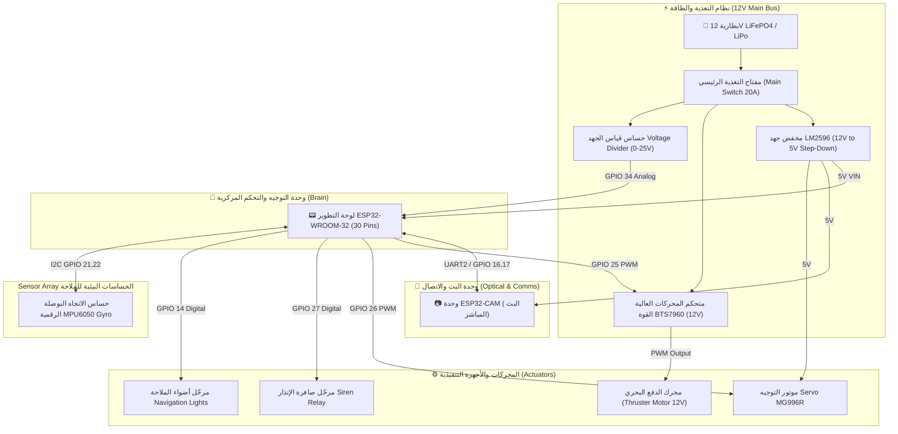

# مخطط تصميم لوحة الدائرة الإلكترونية والتوصيلات (USV Hardware PCB & Wiring Architecture)
---

##  1. المخطط الهندسي العام للنظام (Block Diagram)

---

##  2. جدول التوصيلات الدقيق للأرجل (ESP32 Pinout Mapping Table)

| رقم الطرف (GPIO) | المكون الإلكتروني المرتبط | وظيفة الطرف (Function) | النمط (Mode) | ملاحظات هندسية |
| :--- | :--- | :--- | :--- | :--- |
| **GPIO 25** | BTS7960 Motor Driver | التحكم في سرعة المحرك PWM (RPWM) | Output (PWM) | تردد 5kHz للتحكم السلس |
| **GPIO 33** | BTS7960 Motor Driver | اتجاه الدوران العكسي (LPWM) | Output (PWM) | للتحرك إلى الخلف |
| **GPIO 26** | Servo Motor MG996R | زاوية التوجيه والدفة (Rudder Angle) | Output (PWM) | تغذية 5V خارجية منفصلة |
| **GPIO 27** | Relay Module (Channel 1) | تشغيل صافرة الإنذار الصوتية (Siren) | Output (Digital) | عبر مرحّل معزول الضوضاء |
| **GPIO 14** | Relay Module (Channel 2) | تشغيل أضواء الملاحة الليلية | Output (Digital) | تغذية أضواء 12V/5V |
| **GPIO 34** | Voltage Sensor Divider | قراءة مستوى الجهد والبطارية | Input (Analog) | مقسم جهد R1=30K, R2=7.5K |
| **GPIO 21 (SDA)** | MPU6050 Gyro / Compass | خط البيانات للبوصلة الرقمية | I2C Data | مقاومة Pull-up 4.7K |
| **GPIO 22 (SCL)** | MPU6050 Gyro / Compass | خط التوقيت للبوصلة الرقمية | I2C Clock | مقاومة Pull-up 4.7K |
| **GPIO 16 (RX2)** | ESP32-CAM | استقبال أوامر الكاميرا والـ AI | UART RX | ربط مع TX الكاميرا |
| **GPIO 17 (TX2)** | ESP32-CAM | إرسال الإحداثيات والبيانات للكاميرا | UART TX | ربط مع RX الكاميرا |
| **5V VIN** | Buck Converter LM2596 | التغذية الكهربائية للوحة ESP32 | Power Input | مكثف تنعيم 100uF |
| **GND** | Common Ground Bus | الأرضي الموحد لجميع المكونات | Ground | **ربط جميع أراضي الأجهزة معاً** |

---

## 3. مخطط توزيع خطوط التغذية (Power Distribution Architecture)

1. **خط الجهد العالي (12V Main Power Bus):**
   * مصدر التغذية: بطارية 12V LiFePO4 أو LiPo بسعة 5000mAh فأكثر.
   * يغذي: درايفر المحرك `BTS7960` + مفتاح التغذية الرئيسي + مخفض الجهد `LM2596`.

2. **خط المنظم المنخفض (5V Regulated Bus - Max 3A):**
   * ناتج مخفض الجهد `LM2596 DC-DC Buck Converter`.
   * يغذي: طرف `VIN` للوحة ESP32 + لوحة الكاميرا `ESP32-CAM` + محرك التوجيه `Servo MG996R` + كارت المرحّلات `Relay Module`.

3. **خط أرضي موحد (Common Ground Architecture):**
   * **تنبيه مهم:** يجب ربط أرضي البطارية الـ 12V مع أرضي مخفض الجهد الـ 5V وأرضي الـ ESP32 في نقطة واحدة (Star Ground Point) لمنع الضوضاء الكهربائية وتداخل المحركات.

---

##  4. المكونات المطلوب شراؤها وتجميعها (Bill of Materials - BOM)

1. **متحكم رئيسي:** ESP32 NodeMCU Development Board (30-Pin Version).
2. **كاميرا وبث:** ESP32-CAM Module + Antenna.
3. **درايفر محرك الدفع:** BTS7960 43A High Power Motor Driver H-Bridge.
4. **موتور التوجيه:** MG996R Digital Metal Gear Servo Motor.
5. **مخفض جهد:** LM2596 Buck Converter Step Down Power Module.
6. **مكثفات حماية:** 2x 100uF Electrolytic Capacitors + 0.1uF Ceramic Capacitor.
7. **كارت مرحّلات:** 2-Channel Relay Module 5V with Optocoupler.
8. **بوصلة ومحدد اتجاه:** MPU-6050 6DOF Gyro & Accelerometer Sensor Module.
9. **حساس البطارية:** Voltage Detection Sensor Module (0-25V Range).
