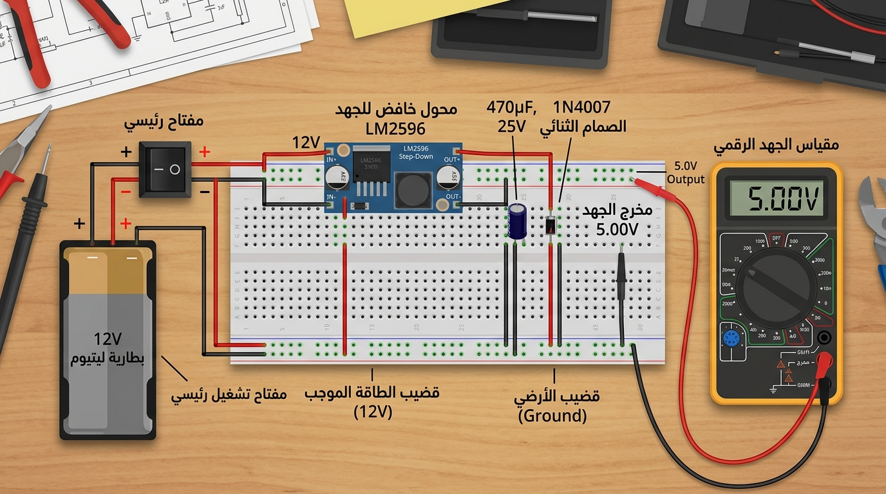
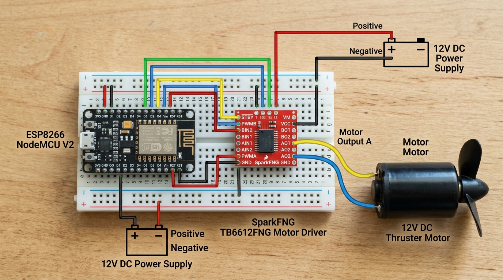
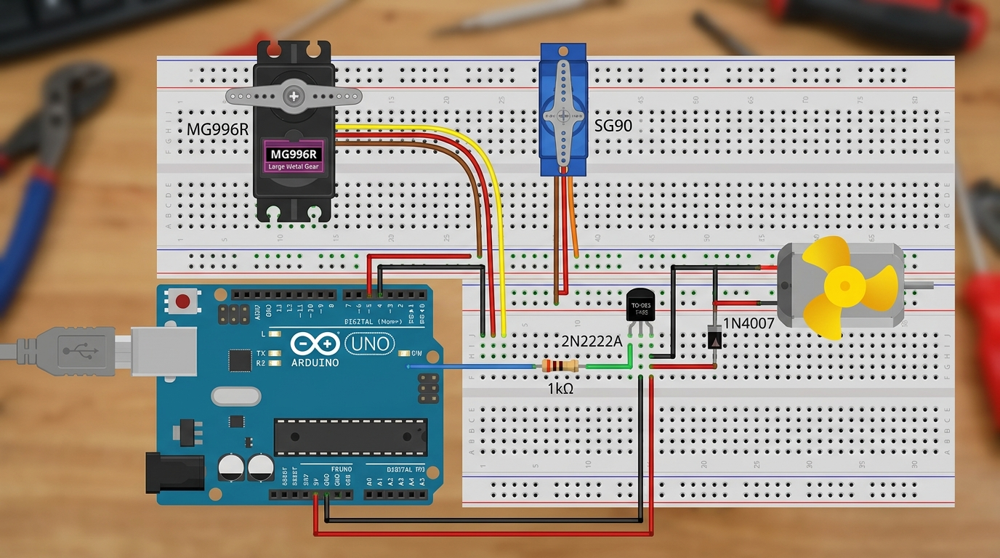
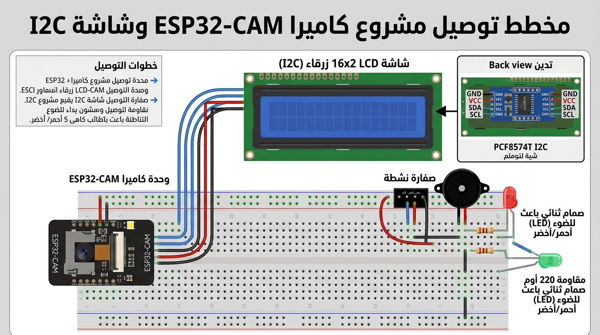

# 📸 دليل التوصيل والتجميع المصور خطوة بخطوة (Visual Hardware Assembly Guide)

هذا الدليل مخصص للتجميع المباشر على **لوحة التجارب (Breadboard)** أو **البوردة النحاسية (Perfboard)**. يحتوي على صورة توضيحية واقعية ملونة قبل كل خطوة تنفيذية ليمكنك تتبع الألوان والأرجل ثم التوصيل فوراً.

---

##  دليل ألوان الأسلاك (Color-Coded Wire Legend)

* 🔴 **الأسلاك الحمراء (Red Wires):** خطوط التغذية الموجبة (+12V للبطارية / +5V للمنظم).
* ⬛ **الأسلاك السوداء (Black Wires):** خط الأرضي الموحد (Common GND Bus).
* 🟡 **الأسلاك الصفراء / البرتقالية (Yellow Wires):** إشارات التحكم والسيرفو الـ PWM.
* 🔵 **الأسلاك الزرقاء / الخضراء (Blue Wires):** خطوط الاتصال الرقمية (I2C: SDA/SCL & UART: TX/RX).

---

## ⚡ 1️⃣ الخطوة الأولى: دائرة تنظيم الجهد واللوح الشمسي (Power Supply & Solar Input)

> **الهدف:** تجهيز خط الطاقة الرئيسي `5.00V` الثابت والآمن لتغذية باقي الشرائح قبل توصيل أي مكون حساس.

### 🛠️ خطوات التنفيد خطوة بخطوة:
1. وصل موجب البطارية 12V أو موجب اللوح الشمسي بطرف **الديود 1N4007** (الجهة السوداء).
2. وصل مخرج الديود (الجهة ذات الخط الفضي) بمدخل `VIN` في منظم الجهد **LM2596** (أو شريحة 7805).
3. ركب المكثف الكيميائي `470uF / 25V` بالتوازي بين مدخل `VIN` والأرضي `GND` (تأكد من قطبية المكثف: السالب على الـ GND).
4. ركب المكثف السيراميكي `0.1uF (104)` لامتصاص أي ضوضاء عالية التردد.
5. **خطوة الفحص الحسمية:** صل الملتيميتر على مخرج الـ LM2596 واضبط المقاومة المتغيرة حتى تقرأ الشاشة **`5.00V`** تماماً.
6. وصل مخرج الـ 5V بالسلك الأحمر بخط الموجب العام للوحة التجارب (`+5V Rail`) ومخرج الـ GND بالسلك الأسود بخط الأرضي العام (`GND Rail`).

---

## ⚙️ 2️⃣ الخطوة الثانية: دائرة ESP8266 ودرايفر المحرك TB6612FNG (Main Motor Circuit)

> **الهدف:** توصيل العقل الرئيسي والتحكم في سرعة واتجاه محرك الدفع البحري الرئيسي (12V DC Motor).

### 🛠️ خطوات التنفيد خطوة بخطوة:
1. **توصيل تغذية الدرايفر TB6612FNG:**
   * **[VM]:** وصل سلك أحمر سميك مباشر من **موجب البطارية +12V** إلى طرف `VM`.
   * **[VCC]:** وصل سلك أحمر من خط التغذية العام `5V Rail` إلى طرف `VCC`.
   * **[GND]:** وصل سلك أسود من خط الأرضي العام `GND Rail` إلى طرف `GND`.
2. **توصيل إشارات التحكم من لوحة ESP8266:**
   * **[STBY]:** وصل سلك أصفر من **ESP8266 Pin D4 (GPIO 2)** إلى `STBY` *(لتفعيل الدرايفر)*.
   * **[PWMA]:** وصل سلك أصفر من **ESP8266 Pin D1 (GPIO 5)** إلى `PWMA` *(التحكم بالسرعة)*.
   * **[AIN1]:** وصل سلك أزرق من **ESP8266 Pin D2 (GPIO 4)** إلى `AIN1` *(دوران للأمام)*.
   * **[AIN2]:** وصل سلك أزرق من **ESP8266 Pin D3 (GPIO 0)** إلى `AIN2` *(دوران للخلف)*.
3. **توصيل المحرك الرئيسي:**
   * وصل طرافي محرك الدفع البحري `12V DC Motor + Propeller` بالطرفين `AO1` و `AO2` في الدرايفر.

---

## 🛠️ 3️⃣ الخطوة الثالثة: دائرة مواتير السيرفو والمواتير الصغيرة (Servos & Small Motors)

> **الهدف:** تحريك دفة السفينة وزاوية الكاميرا والمواتير الاستعراضية (Wind & Paddle Motors).

### 🛠️ خطوات التنفيد خطوة بخطوة:
1. **توصيل سيرفو الدفة الرئيسي (MG996R Metal Servo):**
   * السلك الأحمر (VCC) ⬅️ `5V Rail`.
   * السلك البني/الأسود (GND) ⬅️ `GND Rail`.
   * السلك البرتقالي/الأصفر (Signal) ⬅️ **ESP8266 Pin D5 (GPIO 14)**.
2. **توصيل سيرفو تحريك الكاميرا (SG90 Micro Servo):**
   * السلك الأحمر (VCC) ⬅️ `5V Rail`.
   * السلك البني/الأسود (GND) ⬅️ `GND Rail`.
   * السلك البرتقالي/الأصفر (Signal) ⬅️ **ESP8266 Pin D0 (GPIO 16)**.
3. **توصيل المواتير الصغيرة الاستعراضية (Paddle Wheel & Wind Generator):**
   * الطرف الموجب للموتور الصغير ⬅️ `5V Rail`.
   * الطرف السالب للموتور الصغير ⬅️ طرف **Collector** في ترانزستور **2N2222**.
   * طرف **Base** في الترانزستور ⬅️ يوصل بـ **مقاومة 1kΩ** ثم إلى **ESP8266 Pin D7**.
   * طرف **Emitter** في الترانزستور ⬅️ `GND Rail`.
   * *(تذكر تركيب ديود 1N4007 بالتوازي مع الموتور لحماية الترانزستور).*

---

## 🖥️ 4️⃣ الخطوة الرابعة: دائرة الشاشة والكاميرا والإنذارات (LCD Display, ESP32-CAM & Alarms)

> **الهدف:** عرض البيانات والبيئة على شاشة LCD، بث الفيديو، وتفعيل الإنذار الصوتي والضوئي.

### 🛠️ خطوات التنفيد خطوة بخطوة:
1. **توصيل شاشة LCD 16x2 مع كارت I2C:**
   * **[VCC]:** ⬅️ `5V Rail` | **[GND]:** ⬅️ `GND Rail`.
   * **[SDA]:** سلك أزرق ⬅️ **ESP8266 Pin D2 (GPIO 4)**.
   * **[SCL]:** سلك أخضر ⬅️ **ESP8266 Pin D1 (GPIO 5)**.
2. **توصيل كاميرا البث ESP32-CAM:**
   * **[5V]:** ⬅️ `5V Rail` | **[GND]:** ⬅️ `GND Rail`.
   * ركب مكثف `100uF` بالتوازي بين 5V و GND لمنع إعادة التشغيل أثناء البث.
3. **توصيل الإنذار الصوتي والضوئي:**
   * **Active Buzzer:** الموجب (+) ⬅️ **ESP8266 Pin D6** والسالب (-) ⬅️ `GND Rail`.
   * **Red LED (خطر):** الطرف الطويل (+) عبر **مقاومة 220Ω** ⬅️ **ESP8266 Pin D7** والطرف القصير (-) ⬅️ `GND Rail`.
   * **Green LED (طبيعي):** الطرف الطويل (+) عبر **مقاومة 220Ω** ⬅️ **ESP8266 Pin D8** والطرف القصير (-) ⬅️ `GND Rail`.

---

## نصائح التنفيذ السريع:
* قم بمراجعة كل صورة تخطيطية قبل التوصيل مباشرة لتقارن ألوان وأماكن الأسلاك بقطعتك الفعلية.
* إذا أردت استبعاد أي شاشة أو موتور استعراضي، فما عليك سوى تجاوز خطوتها والانتقال للخطوة التالية فوراً دون تأثير على باقي المشروع!
